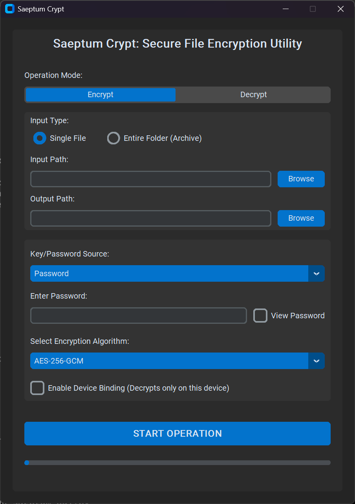

Saeptum Crypt
Saeptum Crypt (Latin for "Secured Enclosure/Vault") is an advanced, multi-algorithm file encryption utility designed for robust data protection. It features strong password-based key derivation (PBKDF2) and unique, proprietary Device Binding to lock files to a specific machine.

This application provides a graphical user interface (GUI) built with CustomTkinter for ease of use.

## Application Preview

🔒 Key Security Features
Multi-Algorithm Support: Encrypt files using modern, secure algorithms: AES-256-GCM, ChaCha20-Poly1305, and AES-256-CBC + HMAC-SHA256.

Device Binding: An optional security layer that ties the encryption key to the unique hardware signature of the computer where the file was encrypted. Files encrypted with this feature cannot be decrypted on any other machine, even if the password is known.

Secure Key Derivation: Utilizes PBKDF2 with 480,000 iterations for highly resistant password protection.

Key File Management: Supports generating and using wrapped key files (.wkey) protected by a secondary passphrase.

Folder Archival: Automatically archives and encrypts entire folders into a single secure file (.tar.enc).

⚙️ Installation and Setup (Source Code)
Saeptum Crypt requires a Python 3 environment and several cryptographic libraries.

Prerequisites
You must have Python 3 (3.8+) installed on your system.

Step 1: Download Files
Download or clone the entire repository to your local machine.

Step 2: Install Dependencies
Navigate to the project's root directory in your terminal and install the required libraries using pip and the included requirements.txt file.

Bash

pip install -r requirements.txt
This command will install customtkinter (for the GUI) and cryptography (for the core security functions).

Step 3: Run the Application
Execute the main GUI script from your terminal:

Bash

python saeptum_gui.py

🛠️ Usage Instructions

Operation Mode: Select Encrypt or Decrypt.

Input/Output: Select the source file/folder and the destination path.

Key/Password Source: Choose Password or Key File.

Device Binding: Check the box to enable hardware locking.

Warning: If enabled, the file must be decrypted on the same computer.

Start Operation: Click START OPERATION. The application will handle the entire process, including key derivation, progress tracking, and secure I/O.

🤝 Integrity Verification (For Source Code)

To verify the integrity of the downloaded source files, you can generate a SHA256 hash of the core cryptographic module (saeptum_core.py) on your system and compare it against the checksum provided in the repository's main release page.
